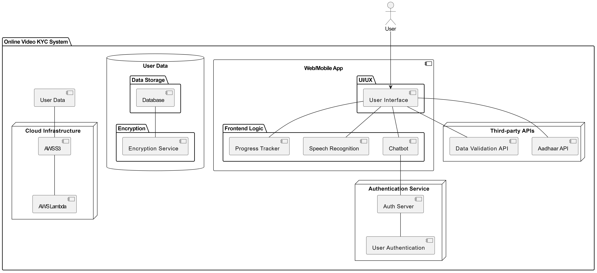
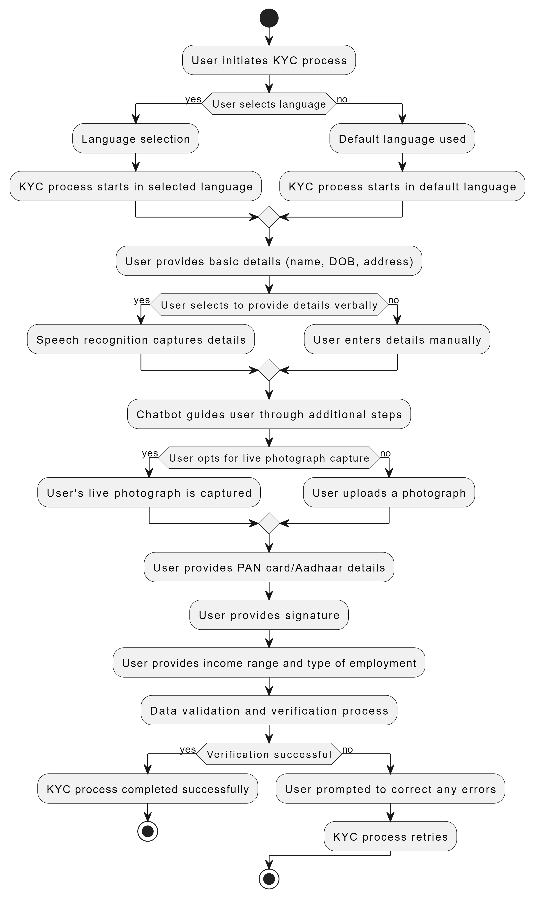

# VeriFyn Video KYC System

An intuitive and self-sufficient online video KYC (Know Your Customer) system that captures user details through a conversational interface.

## Introduction

The Online Video KYC System is designed to streamline the KYC process by offering an interactive video-based solution. It simplifies the user experience while ensuring compliance and security.

## Features

- Interactive video-based KYC process
- Multilingual support for inclusivity
- Conversational interface with AI-powered chatbot
- Speech recognition for data capture
- Live photograph capture for authentication
- Secure data handling with encryption
- Real-time validation and verification
- Accessibility features for users with disabilities

## Demo

[Link to live demo, if available]

## Screenshots

[Include screenshots or GIFs showcasing the user interface and workflow]

## Architecture

### System Architecture

### Workflow Diagram

## Technologies Used

- Frontend:
  - HTML/CSS
  - JavaScript
  - React.js
- Backend:
  - Node.js
  - Express.js
- Database:
  - MongoDB
- Cloud Services:
  - AWS (S3, Lambda)
- Other:
  - TensorFlow (for speech recognition)
  - Aadhaar API (for data validation)

## Setup

1. Clone the repository: `git clone https://github.com/yourusername/online-video-kyc.git`
2. Install dependencies: `npm install`
3. Configure environment variables
4. Start the development server: `npm start`

## Usage

1. Access the application through the provided URL
2. Select preferred language for the KYC process
3. Follow the instructions provided by the chatbot
4. Provide necessary details and validate information
5. Complete the KYC process and receive confirmation

## Contributing

We welcome contributions from the community. If you'd like to contribute, please follow these guidelines:
- Fork the repository
- Create a new branch: `git checkout -b feature/new-feature`
- Make your changes and commit them: `git commit -am 'Add new feature'`
- Push to the branch: `git push origin feature/new-feature`
- Submit a pull request

Please ensure your code adheres to the project's coding standards and includes relevant documentation.

## License

This project is licensed under the [MIT License](LICENSE).
